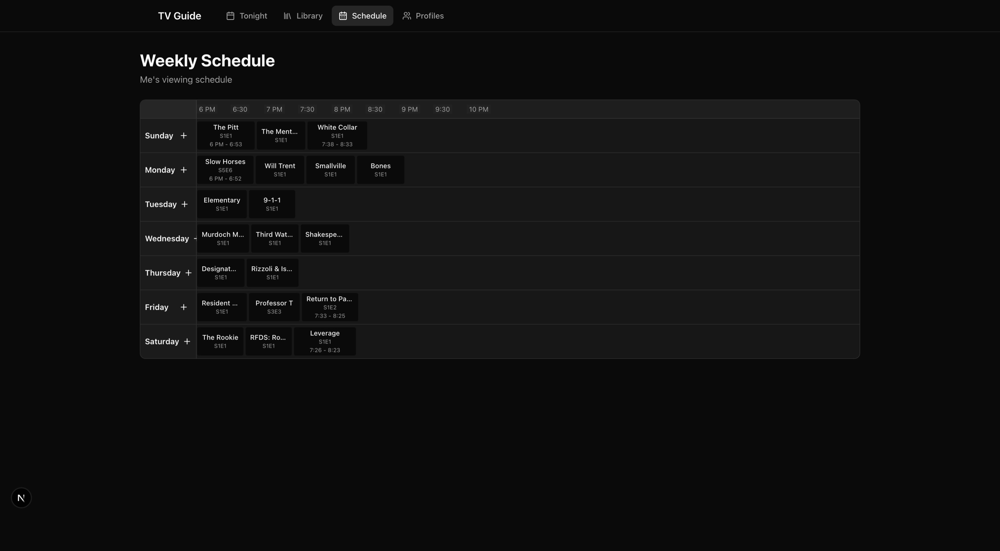
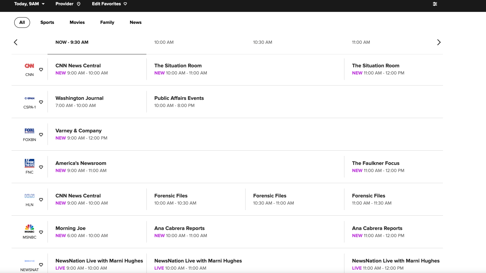

# Family TV Guide

A dark-mode, art-forward web app for families to curate their TV shows and movies, schedule what's on each night, and track viewing progress per profile.

## Features

- **Library Management** — Search TMDB and add TV shows/movies to your household library
- **Weekly Schedule** — Assign titles to days of the week with a TV guide-style grid
- **Tonight View** — See what's scheduled for today with episode artwork and one-click access
- **Progress Tracking** — Track current episode per profile, mark watched, jump to any episode
- **Episode Browser** — Art-dominant grid with stills, titles, and descriptions
- **Episode Detail** — Full overview, cast, guest stars, and optional AI synopsis
- **Person Pages** — IMDb-like actor pages with photo, bio, and filmography
- **AI Synopsis** — Optional spoiler-safe episode summaries powered by Gemini

## Screenshots

| Weekly Schedule | Tonight View |
|-----------------|--------------|
|  |  |

## Tech Stack

- **Framework**: Next.js 16 (App Router)
- **Database**: Supabase (PostgreSQL + Auth + RLS)
- **Styling**: Tailwind CSS v4, shadcn/ui components
- **Metadata**: TMDB API (server-side proxy)
- **AI**: Google Gemini 1.5 Flash (optional)

## Getting Started

### Prerequisites

- Node.js 20+
- A Supabase project
- TMDB API key ([get one here](https://www.themoviedb.org/settings/api))
- (Optional) Google Gemini API key for AI synopsis

### Setup

1. **Clone the repository**
   ```bash
   git clone https://github.com/yourusername/family-tv-guide.git
   cd family-tv-guide
   ```

2. **Install dependencies**
   ```bash
   cd web
   npm install
   ```

3. **Configure environment variables**
   ```bash
   cp .env.local.example .env.local
   ```

   Edit `.env.local` with your credentials:
   ```
   NEXT_PUBLIC_SUPABASE_URL=your-project-url
   NEXT_PUBLIC_SUPABASE_ANON_KEY=your-anon-key
   TMDB_API_KEY=your_tmdb_api_key
   GEMINI_API_KEY=your_gemini_api_key  # Optional
   ```

4. **Run database migrations**

   Apply the migrations in `web/supabase/migrations/` to your Supabase project, in order:
   - `20260118000000_create_mvp_tables.sql`
   - `20260119000000_add_rls_policies.sql`
   - `20260119010000_auto_provision_household.sql`
   - `20260119020000_provision_existing_users.sql`
   - `20260119030000_add_progress_completed.sql`

5. **Start the development server**
   ```bash
   npm run dev
   ```

6. **Open the app**

   Visit [http://localhost:3000](http://localhost:3000)

## Project Structure

```
family-tv-guide/
├── web/                    # Next.js application
│   ├── app/               # App Router pages and API routes
│   │   ├── app/           # Protected app routes
│   │   ├── api/           # API endpoints
│   │   └── (marketing)/   # Public landing page
│   ├── components/        # React components
│   ├── lib/               # Utilities and services
│   │   ├── services/      # Database service layer
│   │   ├── supabase/      # Supabase client setup
│   │   ├── tmdb/          # TMDB API wrapper
│   │   └── gemini/        # Gemini AI client
│   └── supabase/          # Database migrations
├── docs/                   # PRD and technical spec
└── .planning/             # Development planning files
```

## Database Schema

- **households** — Multi-profile household accounts
- **profiles** — Individual viewing profiles (kids/teen/adult maturity)
- **tracked_titles** — TV shows and movies in the library
- **schedule_entries** — Day-of-week scheduling per profile
- **tv_progress** — Episode progress tracking per profile
- **episode_blurbs** — Cached AI-generated synopses

## Attribution

This product uses the TMDB API but is not endorsed or certified by TMDB.


## License

Private project — not open source.
